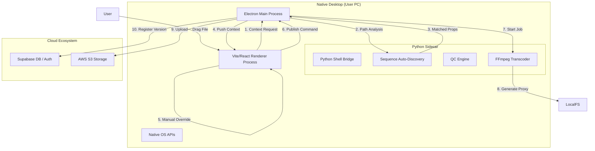

# CTrack Publish V2 - Final Architecture Plan

## 1. High-Level Overview
**CTrack Publish** is a hybrid desktop application designed to bridge the gap between a local artist's workstation and the cloud.
- **Frontend (The Face)**: A Vite + React application running inside Electron, providing a "Pro" dark-mode interface and shared logic with `ctrack_v0`.
- **Backend (The Brain)**: Electron Main Process handles OS-level events (File System access, Tray).
- **Engine (The Muscle)**: A local Python process handles heavy media tasks (FFmpeg transcoding, OpenEXR Metadata, Sequencing) that are hard for JavaScript.

## 2. Technology Stack

| Layer | Technology | Role |
| :--- | :--- | :--- |
| **GUI** | **Vite + React + Shadcn/UI** | Renders the "Context Bar", "Staging Zone", and "Queue". Shared types/components with Web App. |
| **Shell** | **Electron** | Wraps the web app in a native window. Handles `ipcMain` and Native Dialogs. |
| **Compute** | **Python 3.10** | Embedded via `python-shell`. Runs `OpenCV` and `FFmpeg` for media processing. |
| **Data** | **Supabase** | DB (Postgres) and Auth. Shared directly with `ctrack_v0`. |
| **Storage** | **AWS S3** | Cloud storage for uploaded assets. |

## 3. Architecture Diagram

## 4. Module Breakdown

### 4.1 The React Renderer (Frontend)
Located in `/src`.
- **`App.tsx`** / **`main.tsx`**: Root and shell; **`views/QuickPublishView.tsx`**: Main publish flow.
- **`components/layout/ContextBar.tsx`**: The top interaction layer.
    - Handles `Select` events for Project/Shot.
    - Updates Global State (`useContextStore`).
- **`components/layout/StagingZone.tsx`**:
    - React Dropzone integration.
    - Dispatches file paths to Main Process via `ipcRenderer`; supports Smart-Fill from path.
- **`lib/supabase.ts`**: Supabase client for querying Projects/Shots (same backend as `ctrack_v0`).

### 4.2 The Electron Main Process (Backend)
Located in `/electron`.
- **`main.ts`**: App lifecycle, Window creation, Python spawning.
- **IPC handlers** (in `main.ts`):
    - `python-command` (e.g. `scan_folder`): Receives path → Calls Python → Returns scan/context.
    - `start-publish`: Receives Job Data -> Adds to Queue -> Calls Python Transcode.
- **Smart-Fill**: Renderer parses path (e.g. `SH010`) via `lib/path-context.ts` and resolves Project/Shot via `findShotByCode()` (Supabase); user can override in Context Bar.

### 4.3 The Python Sidecar (Engine)
Located in `/python`.
- **`engine.py`**: The entry point. Listens to `stdin` for JSON commands.
- **`modules/scanner.py`**:
    - Walks directories.
    - Groups frames (`.1001.exr`, `.1002.exr`) into Sequences.
    - Detects gaps.
- **`modules/transcode.py`**:
    - Wraps `ffmpeg-python`.
    - Generates MP4 proxies with burn-ins (Text Overlays for Shot Name, Date).
    - Extracts Thumbnails (middle frame).

## 5. Data Flow: The "Smart Publish" Lifecycle

1.  **Ingest**: User drags `D:/Job/SH01/v001`.
2.  **Detection**:
    - Electron sends path to Python.
    - Python `scanner` identifies `SH01` sequence.
    - Electron matches `SH01` to Project List.
3.  **Presentation**:
    - UI updates **Context Bar** dropdowns automatically.
    - **Staging Zone** shows Thumbnail and Health Bar.
4.  **Validation (QC)**:
    - Python checks for missing frames.
    - UI displays "Green Checkmarks" or "Red Alert".
5.  **Submission**:
    - User clicks "Publish".
    - Electron spawns background worker.
    - Python generates MP4.
    - Electron uploads to S3 using Node `aws-sdk`.
    - Electron inserts row to Supabase `shot_versions`.

## 6. Implementation Strategy

### Phase 1: The "Shell"
- Set up `electron-vite` with Vite + React template.
- Configure `ipcMain` and `ipcRenderer` bridge.
- Implement the **Global Context Bar** UI (visual only).

### Phase 2: The "Bridge"
- Bundle a lightweight Python environment.
- Create `engine.py` "echo" script.
- Connect UI Button "Test Python" -> Electron -> Python -> Log Output.

### Phase 3: The "Logic"
- Implement Regex logic in Python.
- Implement FFmpeg transcoding.
- Bind **Context Bar** dropdowns to Supabase data.

### Phase 4: Polish
- Queue System UI for background uploads.
- Auto-Update mechanism.
