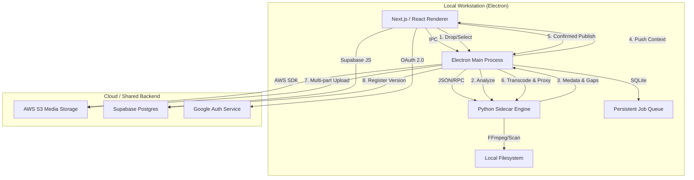

# CTrack Publish V2 - Master Architecture Plan

## 1. Executive Summary
**CTrack Publish** is a high-performance desktop application designed to streamline the VFX asset submission lifecycle. It connects local artist workstations to the **C-Track Cloud Ecosystem** through an automated, intelligent pipeline.

## 2. Core Architecture

## 3. Technology Stack

| Layer | Technology | Role |
| :--- | :--- | :--- |
| **GUI** | **React + Vite + Shadcn/UI** | Responsive Pro-grade Dark Mode interface. |
| **Shell** | **Electron 30+** | Native bridge, File System access, and Process lifecycle. |
| **Logic** | **Node.js (Main Process)** | AWS S3 Integration, Queue Persistence, IPC Handling. |
| **Engine** | **Python 3.10** | **The Muscle**: FFmpeg, OpenImageIO, Metadata parsing. |
| **Auth** | **Supabase (Google OAuth)** | Consistent identity sharing with `ctrack_v0`. |
| **Database** | **PostgreSQL (Supabase)** | Centralized metadata for Shots, Sequences, and Versions. |
| **Storage** | **AWS S3** | Optimized storage for high-res proxies and thumbnails. |

## 4. Feature Modules

### 4.1. Identity (Google OAuth)
- **Shared Backend**: Shared credentials with `ctrack_v0`.
- **Flow**: App launches → Login with Google → JWT token stored in System Keychain → Silent re-auth on next launch.
- **Provider**: Supabase Auth (OAuth 2.0).

### 4.2. UI Navigation (3-Tab System)
The app is organized into three primary operational modes:
1.  **Quick Publish**: Single-sequence drop, auto-detection of metadata, and instant submission.
2.  **Bulk Ingest**: High-volume, recursive folder scanner for library plates or show-wide deliveries.
3.  **Queue Monitor**: Real-time status tracker for transcoding/upload tasks with persistence.

### 4.3. Python Sidecar Engine (The Sidecar)
- **Scanner**: Python script for grouping loose frames into sequences and identifying gaps.
- **Transcoder**: FFmpeg-python wrapper for:
    - **Proxies**: H.264 MP4 with Color space conversion (Linear to Rec.709).
    - **Thumbnails**: Optimized JPEG extraction from middle frame.
    - **GIFs**: 10-frame animated hover previews.
    - **Burn-ins**: Shot name, Artist, Date, and Frame count overlays.

### 4.4. Resilient Job Queue
- **Persistence**: SQLite database tracks every job (Metadata, Progress, Retries).
- **Restart Recovery**: Interrupted uploads/transcodes resume automatically on app relaunch.
- **Parallelism**: Concurrent processing of up to 3 jobs (configurable).

## 5. Metadata Mapping (C-Track Schema)
The app maps file paths directly to the Supabase database:
- **`shot_versions`**: For Artist submissions (Comp, Lighting, FX).
- **`shot_elements`**: For Ingest submissions (Plates, References, HDRIs).

## 6. Implementation Stages (Revised)

### Stage 1: Auth & Shell V2
- [ ] Port/Refactor `useAuth` from `ctrack_v0`.
- [ ] Implement Google Login UI.
- [ ] Build the Sidebar Tab Navigation system.

### Stage 2: Scanning & Logic (The Brain)
- [ ] Advanced recursive scanner in Python.
- [ ] Regex Pattern Matching system (15 common VFX patterns).
- [ ] "Health Check" logic for sequences (Gaps, Format mismatches).

### Stage 3: Media & Cloud (The Pipe)
- [ ] Finish FFmpeg Burn-in overlays.
- [ ] Animated GIF generation logic.
- [ ] Multi-part S3 upload progress feedback.

### Stage 4: Admin & Ingest
- [ ] Grid View for Bulk Ingest.
- [ ] Batch context assignment.
- [ ] Queue history and log export.
